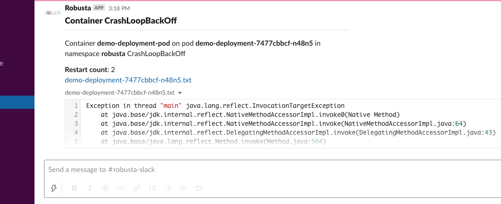
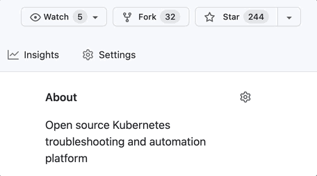

  <h1 align="center">Robusta - Better Prometheus Notifications for Kubernetes</h1>
  <h2 align="center">Better grouping, enrichment, and remediation of your existing alerts</h2>
  

    <a href="#%EF%B8%8F-how-it-works"><strong>How it Works</strong></a> |
    <a href="#-installing-robusta"><strong>Installation</strong></a> |
    <a href="https://docs.robusta.dev/master/configuration/index.html"><strong>Integrations ↗</strong></a> |
    <a href="https://docs.robusta.dev/master/index.html"><strong>Docs ↗</strong></a> |
    <a href="https://bit.ly/robusta-slack"><strong>Slack Community ↗</strong></a>
  

## What Can Robusta Do?

Compatible with kube-prometheus-stack, Prometheus Operator, and more.

Robusta integrates with Prometheus by webhook and adds features like:

* [**Smart Grouping**](https://docs.robusta.dev/master/configuration/notification-grouping.html) - reduce notification spam with Slack threads 🧵
* [**AI Investigation**](https://docs.robusta.dev/master/configuration/holmesgpt/index.html#ai-analysis) -  Kickstart alert investigation with AI (optional)
* [**Alert Enrichment**](https://docs.robusta.dev/master/how-it-works/index.html#automatically-investigate-a-prometheus-alert) - see pod logs and other data alongside your alerts
* [**Self-Healing**](https://docs.robusta.dev/master/tutorials/alert-remediation.html#remediate-prometheus-alerts) - define auto-remediation rules for faster fixes
* [**Advanced Routing**](https://docs.robusta.dev/master/notification-routing/configuring-sinks.html) based on team, namespace, and more
* [**Problem-Detection without PromQL**](https://docs.robusta.dev/master/playbook-reference/triggers/index.html#triggers-reference) - generate Kubernetes-native alerts for OOMKills, failing Jobs, and more
* [**Change-Tracking**](https://docs.robusta.dev/master/tutorials/playbook-track-changes.html#track-kubernetes-changes) for Kubernetes Resources to correlate alerts and rollouts
* [**Auto-Resolve**](https://docs.robusta.dev/master/configuration/sinks/jira.html#jira) - update external systems when alerts are resolved (e.g. Jira)
* [**Dozens of Integrations**](https://docs.robusta.dev/master/configuration/index.html#integrations-overview) - Slack, Teams, Jira, and more

Don't have Prometheus? You can use Robusta without Prometheus, or install our all-in-one Kubernetes observability stack with Robusta and Prometheus included.

## 🛠️ How it works

Robusta uses rules and AI to take Prometheus alerts and add extra information to them, such as pod logs, relevant graphs, possible remediations, and more.

Here is an example alert in Slack:

Here is an example remediation action:

[Learn more »](https://docs.robusta.dev/master/how-it-works/index.html)

(<a href="#top">back to top</a>)

## 📒 Installing Robusta

Robusta is installed with Helm. For convenience, we provide a CLI wizard to generate Helm values.

You can install Robusta alongside your existing Prometheus, or as an all-in-one bundle with Robusta and a preconfigured `kube-prometheus-stack`.

To get *even more* out of Robusta, we recommend creating [a free Robusta UI account](#-free-robusta-ui). Learn more below.

[Create a free Robusta UI account »](https://platform.robusta.dev/signup?utm_source=github&utm_medium=robusta-readme&utm_content=installing_robusta_section)

[Installation instructions »](https://docs.robusta.dev/master/setup-robusta/installation/index.html)

<!-- 
(<a href="#top">back to top</a>)
 -->

## 🖥 Free Robusta UI
Take your Kubernetes monitoring to the next level with the [Robusta SaaS platform](https://platform.robusta.dev/signup?utm_source=github&utm_medium=robusta-readme&utm_content=free_robusta_ui_section). Creating an account is free, and includes:

- **AI Assistant**: Solve alerts faster with an AI assistant that highlights relevant observability data
- **Alert Timeline**: View Prometheus alerts across multiple clusters and spot correlations with a powerful timeline view
- **Change Tracking**: Correlate alerts with changes to your infrastructure or applications, with Robusta’s automatic change tracking for Kubernetes

  

## 📝 Documentation
Interested? Learn more about Robusta.

[Full documentation »](https://docs.robusta.dev/master/index.html)

(<a href="#top">back to top</a>)

## ✉️ Contact

* Slack - [robustacommunity.slack.com](https://bit.ly/robusta-slack)
* Twitter - [@RobustaDev](https://twitter.com/RobustaDev)
* LinkedIn - [robusta-dev](https://www.linkedin.com/company/robusta-dev/)
* Email Support - [support@robusta.dev ](mailto:support@robusta.dev )

(<a href="#top">back to top</a>)

## 📑 License
Robusta is distributed under the MIT License. See [LICENSE.md](https://github.com/robusta-dev/robusta/blob/master/LICENSE) for more information.

## 🕐 Stay up to date
We add new features regularly. Stay up to date by watching us on GitHub.

