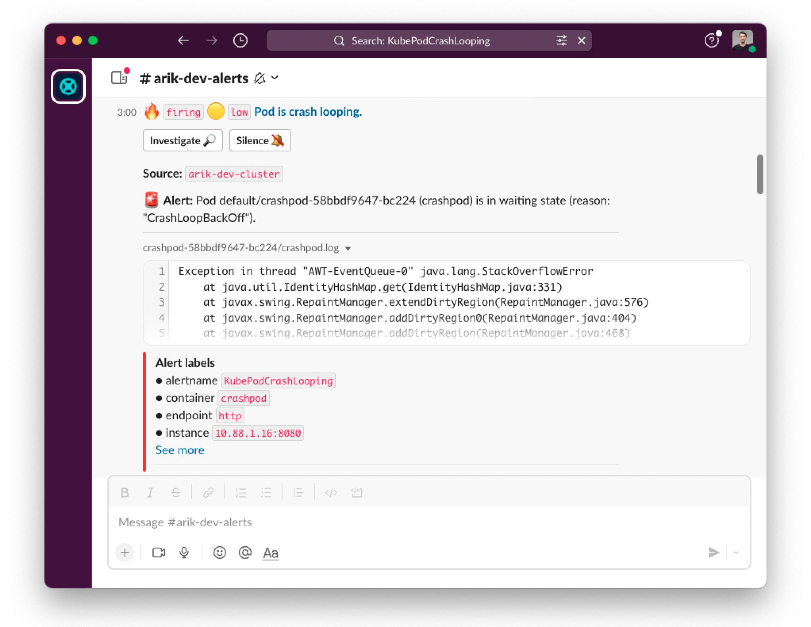

# Robusta
Robusta is a troubleshooting and automations platform for Kubernetes. It streamlines everything that happens **after** you deploy your application. It is somewhat like Zapier/IFTTT for devops, with an emphasis on prebuilt useful automations and not just "build your own".

##
Use cases

- [X] Event-triggered automations for Kubernetes (like Argo Events) with an emphasis on simplicity
- [X] Kubernetes monitoring - Prometheus + Robusta = better alerts that tell you *why* they happened and how to fix them
- [X] Auto-remediations - out of the box fixes for common alerts + write your own
- [X] [Change tracking - track and audit every change to your Kubernetes cluster](http://home.robusta.dev/ui?from=github)

[Read the docs for more info](https://docs.robusta.dev/master/?from=github) or see screenshots and demos at [robusta.dev](http://robusta.dev/?from=github)

[](https://twitter.com/RobustaDev) 

## Examples

Monitor crashing pods and send their logs to Slack:

```yaml
triggers:
  - on_prometheus_alert:
      alert_name: KubePodCrashLooping
actions:
  - logs_enricher: {}
sinks:
  - slack
```



Remediate alerts with the click of a button:


Take manual troubleshooting actions, like [attaching a debugger to a python pod](https://docs.robusta.dev/master/catalog/actions/python-troubleshooting.html#python-debugger):

```commandline
robusta playbooks trigger python_debugger name=mypod namespace=default
```

[There are over 50 built-in automations.](https://docs.robusta.dev/master/catalog/actions/index.html)

# Stay up to date
We add new features regularly. Stay up to date by watching us on GitHub.


# Installing Robusta

1. Install our python cli:

```commandline
python3 -m pip install -U robusta-cli --no-cache
```

2. Generate a values file for Helm:
```commandline
robusta gen-config
```

3. Install Robusta with Helm:
```commandline
helm repo add robusta https://robusta-charts.storage.googleapis.com && helm repo update
helm install robusta robusta/robusta -f ./generated_values.yaml
```

Full instructions are in our [installation guide](https://docs.robusta.dev/master/installation.html).

# Documentation
Interested? Read the [full documentation](https://docs.robusta.dev/master/index.html)
