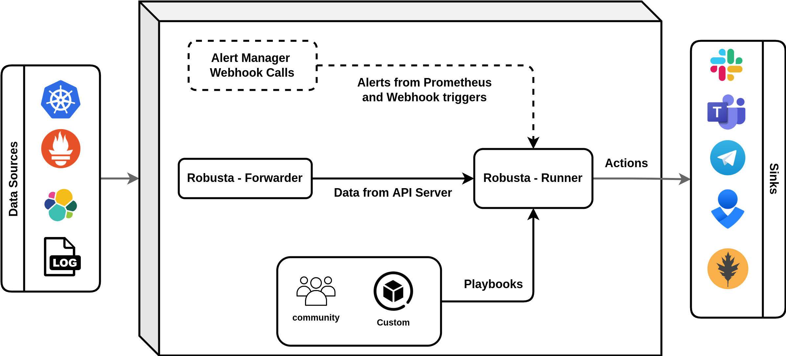

Architecture
####################

Standard Architecture
-------------------------

Robusta is installed and managed with Helm.

It has five components:

1. Two in-cluster Kubernetes deployments (see below)
2. *Optional*: Default Prometheus alerts, fine-tuned for Kubernetes (based on upstream but improved)
3. *Optional*: A bundled Prometheus stack (Prometheus Operator, AlertManager, and Grafana)
4. *Optional*: A client-side :ref:`robusta <CLI Commands>` cli
5. *Optional*: A cloud UI to view all alerts and events in your cluster

Kubernetes Deployments
^^^^^^^^^^^^^^^^^^^^^^
robusta-forwarder
    Connects to the APIServer and monitors Kubernetes changes. Forwards them to robusta-runner.

robusta-runner
    Executes playbooks

