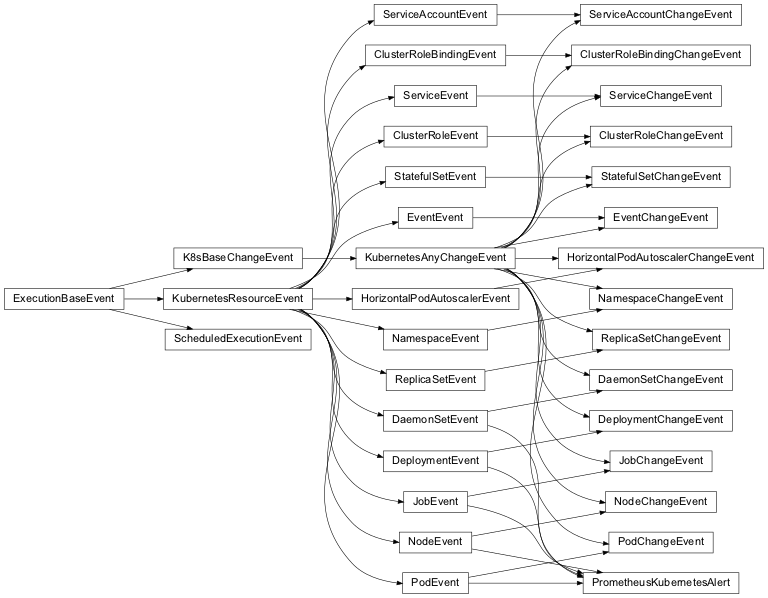

Event Hierarchy
=====================

When configuring Robusta as a user, you define :ref:`triggers <Triggers>` in ``values.yaml`` but when writing playbook
actions you deal with events.

This page explains the connection between the two.

Lifecycle of a Robusta event
^^^^^^^^^^^^^^^^^^^^^^^^^^^^^^^^^^^^^^
1. A pod changes
2. The API Server notifies Robusta
3. Robusta checks if any triggers like ``on_pod_update`` are activated by the pod change
4. If yes, Robusta calls that trigger
5. The trigger converts data from the APIServer to a concrete event like ``PodChangeEvent``
6. The ``PodChangeEvent`` is passed to all playbook actions

Here is the Robusta event hierarchy:

..
    the above image was generated like this by a patched version of inheritance-diagram based on
    https://github.com/sphinx-doc/sphinx/pull/8159
    .. inheritance-diagram2:: robusta.api.ExecutionBaseEvent
        :parts: 1
        :include-subclasses:

Support manual triggers
^^^^^^^^^^^^^^^^^^^^^^^^^^
You're writing a playbook action and you'd like to support :ref:`manual triggers`. It's easy.

All classes above with names like ``PodEvent`` support manual triggers automatically. When running the manual trigger
specify the pod's name and Robusta will generate an artificial event.

On the other hand, events like ``PodChangeEvent`` don't support manual triggers. ``PodChangeEvent`` cannot be generated
artificially because it requires two versions of the pod - a before and after version.