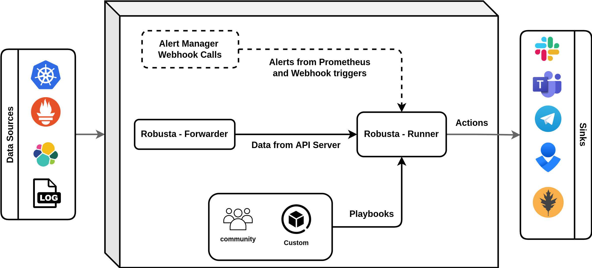

Architecture
==================

Robusta follows a modular architecture designed to integrate seamlessly with your existing Kubernetes observability stack. The system consists of core components that run in-cluster and optional components for enhanced functionality.

Core Components
^^^^^^^^^^^^^^^

Robusta's core architecture runs entirely within your Kubernetes cluster:

**robusta-forwarder**
  A lightweight deployment that connects to the Kubernetes APIServer to monitor cluster events and resource changes. It forwards relevant events to the runner component for processing. This component ensures Robusta stays up-to-date with your cluster state in real-time.

**robusta-runner** 
  The main processing engine that receives events from the forwarder, evaluates playbook rules, executes enrichment actions, and sends notifications to configured destinations. It contains the business logic for alert correlation, data enrichment, and routing decisions.

Data Flow
^^^^^^^^^

1. **Event Collection**: The forwarder monitors Kubernetes APIServer for resource changes and forwards them to the runner
2. **Alert Processing**: Prometheus AlertManager webhooks are received by the runner for alert enrichment
3. **Playbook Execution**: The runner evaluates configured playbooks and triggers appropriate actions
4. **Enrichment**: Additional context is gathered (logs, metrics, resource states) and attached to alerts
5. **Routing**: Enriched alerts are routed to configured sinks (Slack, Teams, etc.) based on routing rules

Extended Architecture
^^^^^^^^^^^^^^^^^^^^

**AI Analysis with HolmesGPT**
  Robusta's AI engine automatically investigates alerts by analyzing logs, events, and cluster state to provide root cause analysis and remediation suggestions. See :ref:`AI Analysis <AI Analysis>` for configuration details.

**Prometheus Integration**
  Robusta can work with your existing Prometheus setup or be installed with a :ref:`bundled Prometheus stack <embedded Prometheus stack>` powered by ``kube-prometheus-stack``. The integration enables automatic alert enrichment and correlation.

**Centralized Management**
  The Robusta `SaaS platform <http://home.robusta.dev/?from=docs>`_ provides centralized alert management, historical analysis, and cross-cluster visibility. Self-hosted options are available for enterprise deployments.

**CLI Tooling**
  The ``robusta`` CLI simplifies installation and configuration management by auto-generating Helm values and providing cluster diagnostics.

Security & Networking
^^^^^^^^^^^^^^^^^^^^^

* All core components run within your cluster with configurable RBAC permissions.
* External integrations use secure webhook endpoints with optional authentication.
* SaaS connectivity is outbound-only with no inbound access required.
* All data remains in your cluster unless explicitly sent to configured sinks e.g. Slack, Robusta UI.

Next Steps
^^^^^^^^^^

:ref:`Ready to install Robusta? Get started. <install>`
