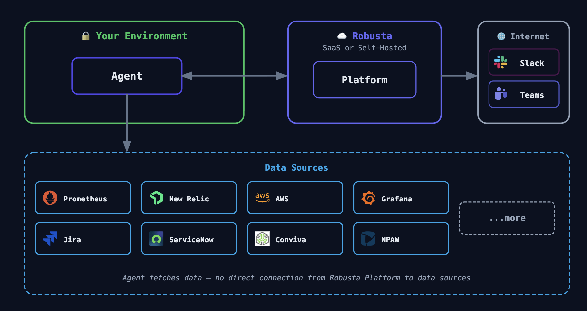

Architecture
==================

Robusta uses `HolmesGPT <https://github.com/robusta-dev/holmesGPT>`_, an open source AI agent, to automatically investigate and root-cause Kubernetes alerts. HolmesGPT runs as part of the **in-cluster Agent**, connects to your existing **data sources**, and reports findings through the **Robusta Platform** (SaaS or self-hosted).

|

Agent (In-Cluster)
^^^^^^^^^^^^^^^^^^^

The Robusta Agent runs inside your Kubernetes cluster. It includes HolmesGPT and is responsible for:

- Receiving alerts from Prometheus AlertManager and other sources
- Running HolmesGPT to automatically investigate each alert
- Fetching data from external data sources (Prometheus, Grafana, New Relic, AWS, Jira, ServiceNow, and more)
- Monitoring Kubernetes resource changes and gathering logs and events

The Agent keeps your data secure — it fetches data from your data sources directly, so there is no direct connection from the Robusta Platform to your data sources.

Robusta Platform
^^^^^^^^^^^^^^^^^

The Robusta Platform provides a centralized web UI for managing alerts and investigations across clusters. It is available as **SaaS** (hosted by Robusta) or **self-hosted** (for enterprise deployments).

The Platform receives investigation results from HolmesGPT and provides:

- AI-powered root cause analysis results for every alert
- Centralized alert management and triage across multiple clusters
- Historical alert analysis and timelines
- Notification routing to Slack, Microsoft Teams, and other channels
- :doc:`Additional pro features <../configuration/exporting/robusta-pro-features>`

Data Sources
^^^^^^^^^^^^^

HolmesGPT integrates with a wide range of data sources in your environment to gather evidence during investigations:

- **Monitoring**: Prometheus, Grafana, New Relic, AWS CloudWatch, NPAW, Conviva
- **ITSM & Ticketing**: Jira, ServiceNow
- **And more**: Data source integrations are extensible

All data source connections are made by the Agent within your environment. The Robusta Platform never connects to your data sources directly.

Notification Channels
^^^^^^^^^^^^^^^^^^^^^^

Investigation results and enriched alerts are routed to your preferred notification channels:

- Slack
- Microsoft Teams
- PagerDuty
- And :doc:`many more sinks <../configuration/configuring-sinks>`

Security & Networking
^^^^^^^^^^^^^^^^^^^^^

- The Agent runs entirely within your cluster with configurable RBAC permissions
- Data sources are accessed only by the in-cluster Agent, never by the Platform
- SaaS connectivity is outbound-only — no inbound access is required
- All data remains in your cluster unless explicitly sent to configured sinks or the Robusta Platform

Next Steps
^^^^^^^^^^

:ref:`Ready to install Robusta? Get started. <install>`
