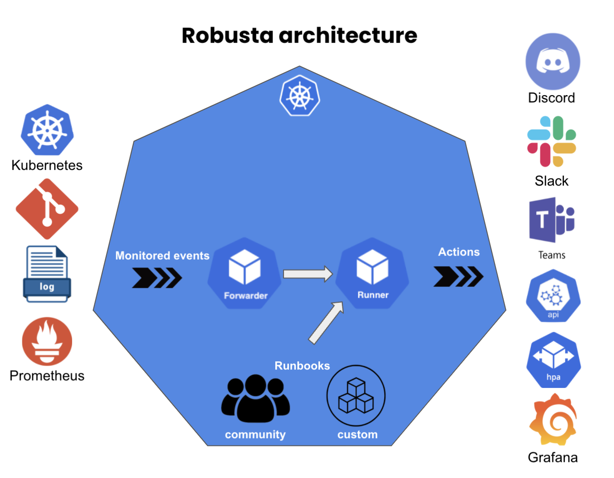

.. Robusta documentation master file, created by
   sphinx-quickstart on Thu Apr 29 00:59:51 2021.
   You can adapt this file completely to your liking, but it should at least
   contain the root `toctree` directive.

Welcome to Robusta!
~~~~~~~~~~~~~~~~~~~
You're on your way to automating your Kubernetes devops!

Robusta makes cloud operations and maintenance more reliable with maintenance as code. Common use cases are:

* Forwarding important Kubernetes events to Slack with context
* Gathering troubleshooting data when Prometheus alerts fire
* Applying remediations when known issues occur
* Tracking changes to Kubernetes objects

Robusta turns all the above maintenance operations into re-usable maintanance-as-code playbooks. See the :ref:`list of builtin playbooks <List of built-in playbooks>` or write your own.

:ref:`Ready to install Robusta? Get started! <Installing Robusta>`

Still not convinced? See `the demos on our website <http://startup.natanyellin.com/>`_.

.. toctree::
   :maxdepth: 4
   :caption: Getting Started
   :hidden:

   getting-started/installation
   getting-started/uninstallation
   getting-started/customization
   getting-started/manual-triggers

.. toctree::
   :maxdepth: 4
   :caption: User Guide
   :hidden:

   user-guide/builtin-playbooks
   user-guide/alerts
   user-guide/playbook-configuration
   user-guide/slack
   user-guide/prometheus
   user-guide/architecture

.. toctree::
   :maxdepth: 4
   :caption: Developer Guide
   :hidden:

   developer-guide/writing-playbooks
   developer-guide/general-guidelines
   developer-guide/scheduled-playbooks
   developer-guide/reference
