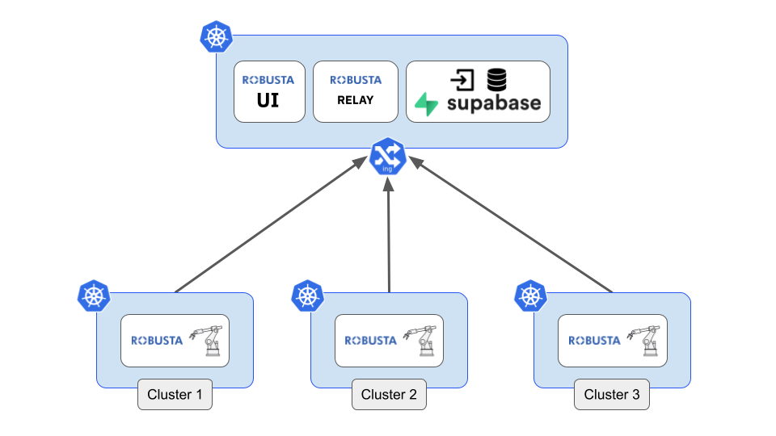

Open Source vs SaaS
################################

There are several ways to use Robusta:

- :ref:`Robusta Open Source (OSS)<Installation>`: A monitoring and automation engine that runs in your own cluster.
- Robusta OSS + Cloud `Robusta UI <https://home.robusta.dev/ui/>`_: The Robusta OSS combined with a powerful cloud UI.
- Robusta OSS + Self hosted Robusta UI: Manage the UI yourself, installed on your own Kubernetes cluster.

Which option is right for me?
^^^^^^^^^^^^^^^^^^^^^^^^^^^^^

For most people, the Robusta OSS + Cloud UI is the right option. :ref:`Install the OSS <Installation>` and enable the UI to use it.

You can also use the Robusta OSS without the cloud UI.

Lastly, if you want to use the UI but are unable to send data to our cloud, you can :ref:`self-host the UI <Installing the self-hosted UI>` with our paid plans.

Pricing
^^^^^^^^^^^^
The Robusta OSS is and always will be free. It is MIT licensed.

The Robusta UI is `free to get started <https://home.robusta.dev/pricing>`__

We also have enterprise plans if you need to self-host the UI in your own environment.

Contact support@robusta.dev for all questions.

Self hosted architecture
^^^^^^^^^^^^^^^^^^^^^^^^^^^^^

The Robusta backend consists of the following components, installed via a `helm chart <https://helm.sh/>`_, on a Kubernetes cluster of your choice:

- `Supabase <https://supabase.com/>`_: stores all alerts and troubleshooting data in a Postgres DB. Handles user authentication.
- Robusta UI Frontend: alerting dashboard built just for Kubernetes.
- Robusta Relay: handles Slack integration and more.

In addition to the backend services, an installation of the base Robusta OSS project is required, on one or more clusters.

Instead of using the cloud backend services, the Robusta OSS project will be directed to the self hosted backend instance.

Installing the self-hosted UI
^^^^^^^^^^^^^^^^^^^^^^^^^^^^^^^
To install the Robusta self hosted instance, please contact support@robusta.dev, or post in the #support channel of `our Slack community <https://bit.ly/robusta-slack>`_.
