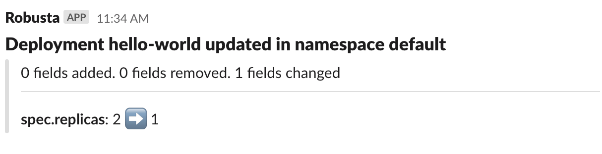
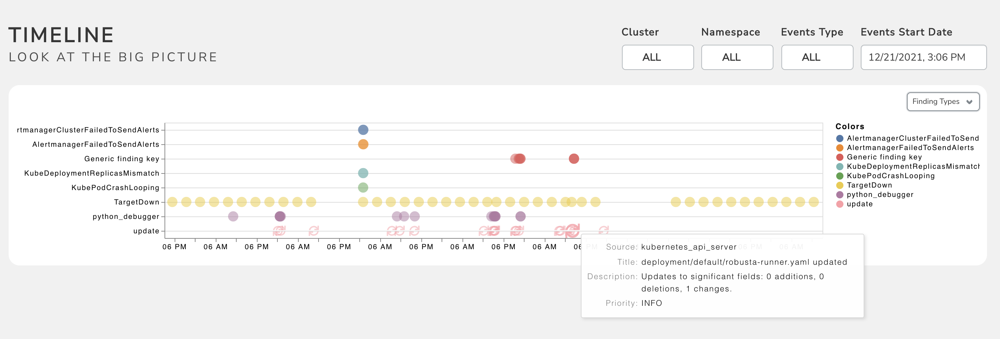
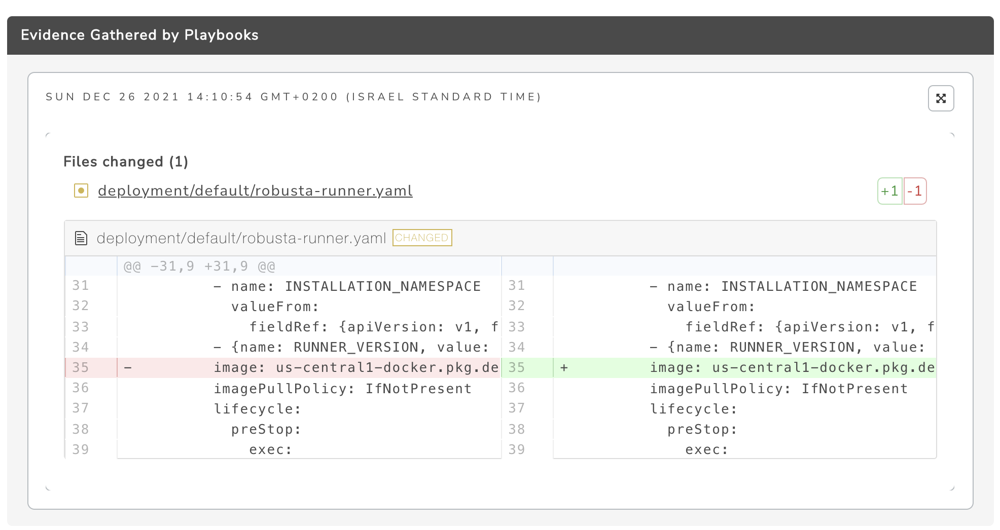

Enrich Prometheus alerts
##################################

To demonstrate how Robusta automations work, we will configure an automation that sends Slack messages when deployments change.

.. note::

    If you use the `Robusta UI <https://home.robusta.dev/ui/>`_, changes like this are already tracked in the UI by default.

    This tutorial explains how that feature works under the hood.

1. Add the following to your ``generated_values.yaml``:

.. code-block:: yaml

    customPlaybooks:
    - triggers:
        - on_deployment_update: {}
      actions:
        - resource_babysitter:
            omitted_fields: []
            fields_to_monitor: ["spec.replicas"]

2. Perform an upgrade with Helm to apply the new configuration

.. code-block:: bash

    helm upgrade robusta robusta/robusta --values=generated_values.yaml

Seeing the automation in action
----------------------------------

1. Scale one of your deployments:

.. code-block:: python

   kubectl scale --replicas NEW_REPLICAS_COUNT deployments/DEPLOYMENT_NAME

2. Check the slack channel you configured when installing Robusta:

If you setup the `Robusta UI <https://home.robusta.dev/ui/>`_, it will appear in the timeline of all alerts and changes:

You can click to see the diff:

How the automation works
----------------------------------
Every automation has three parts.

triggers:
    We chose ``on_deployment_update`` which runs whenever Kubernetes Deployments are updated

actions:
    We chose :ref:`Resource babysitter` which is a builtin action. That action has a parameter ``fields_to_monitor``.

sinks:
    We didn't configure any sinks, so output is sent to the default sink. This is usually Slack and/or the `Robusta UI <https://home.robusta.dev/ui/>`_.

Further customization
------------------------
Try changing the configuration to monitors changes to a deployment's image tag.

Cleanup
------------------------
If you use the `Robusta UI <https://home.robusta.dev/ui/>`_, you should disable the automation you configured in this tutorial to prevent duplicates.

A similar automation is already configured by default.